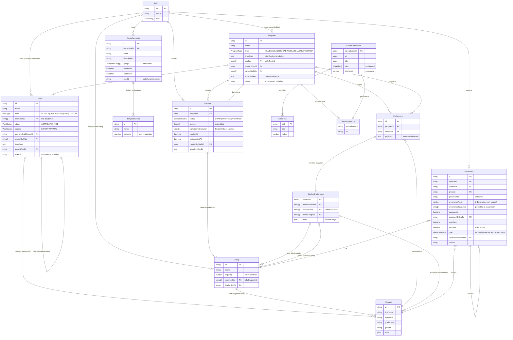

# Groupwheel Data Model

Entity-relationship diagram showing all domain entities and their relationships.

## Legend

| Symbol | Meaning |
|--------|---------|
| `PK` | Primary Key |
| `FK` | Foreign Key reference |
| `\|\|--\|{` | one-to-many (required) |
| `\|\|--o{` | one-to-many (optional) |
| `}o--\|\|` | many-to-one (optional on many side) |

## Notes

- **Embedded arrays** (like `Group[]` in Scenario) are stored directly within the parent entity, not as separate tables
- **Multi-tenancy**: Major entities include `userId?: string` for data isolation when users authenticate via Google OAuth
- **Snapshots**: Scenario stores `participantSnapshot` and Placement stores `preferenceSnapshot` for historical accuracy
- Source code: `src/lib/domain/`
